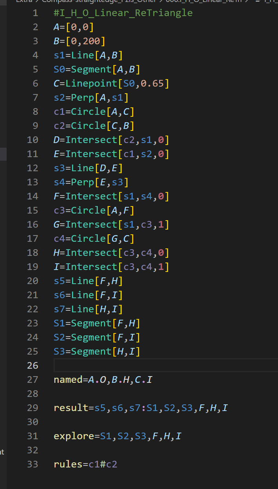
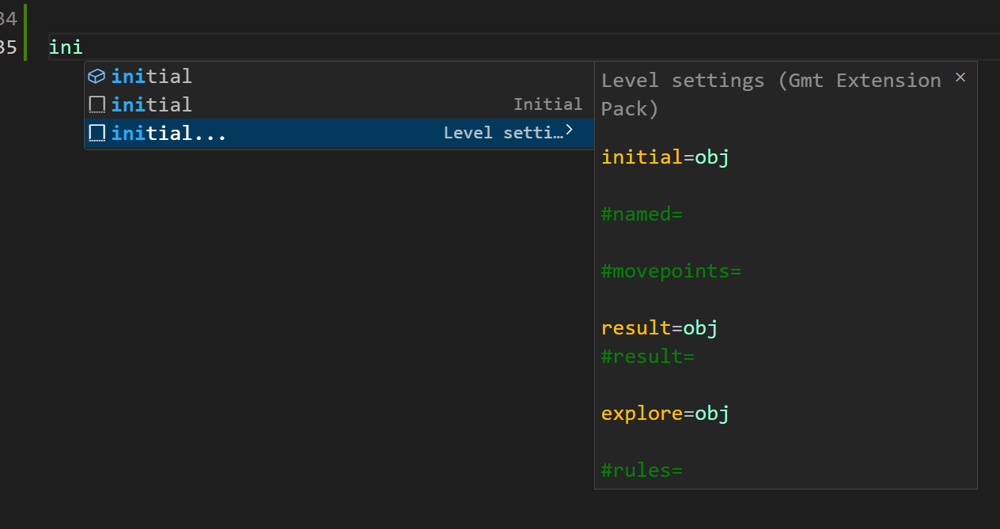

# Gmt-Extension-Pack

A multifunctional extension pack for gmt files of the game Euclidea.

## Features

**Display various parts of the code in different colors for easy editing and debugging:**

Geometric figures(points, lines, circles, names)

Constructional functions(like 'Line' and 'Circle', basic and advanced)

Numbers(values)

Arguments(in the functions 'Intersect', 'EdgePoint' and 'Tangent')

Level setting variables(like 'initial', 'result' and 'explore')

Connecting symbols(':', '.' and '|')

Operating symbols('#', '/', '<' and '>')

Comments

---

**Automatic completion of functions and blocks:**

Constructional functions

level settings

---

## Usage

0. Visual Studio Code (with Nodejs) ; Git
1. Open this extension pack
2. F5 to open a new VSCode window
3. Open a gmt file
4. Enjoy

## More

Our repo [Euclidea-Re-vival](https://github.com/MT9799/Euclidea-Re-vival) has been opened!

Come, challenge and optimize the latest new puzzles!
