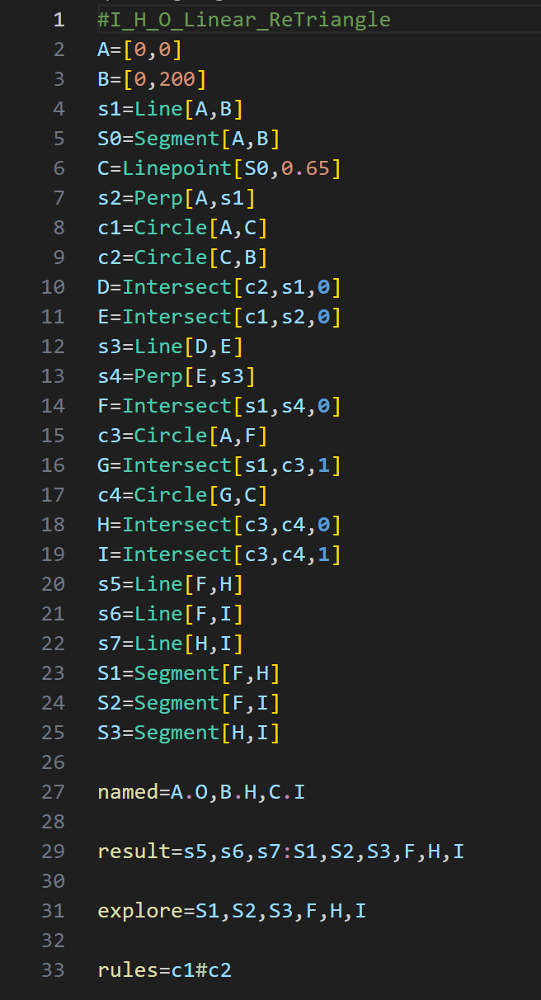

# Gmt-Syntax-Highlighting

A syntax highlighting extension pack for gmt files of the game Euclidea.

## Features

Display various parts of the code in different colors for easy editing and debugging.

* Geometric figures(like 'A', 'S1' and 'c1'): light blue
* Constructional functions(like 'Line' and 'Circle'): cyan
* Numbers: orange
* Arguments(in the functions 'Tntersect', 'EdgePoint' and 'Tangent'): dark blue, bold
* Level setting variables(like 'initial', 'result' and 'explore'): yellow
* Connecting symbols(':' and '.'): purple
* Conparing symbols('#', '/', '<' and '>'): light green
* Comments: dark green

## Usage

0. Visual Studio Code

1. Open this extension pack
3. F5 to open a new VSCode window
4. Open a gmt file
5. Enjoy

## More

Our repo [Euclidea-Re-vival](https://github.com/MT9799/Euclidea-Re-vival) has been opened!

Challenge and optimize the latest new puzzles!
